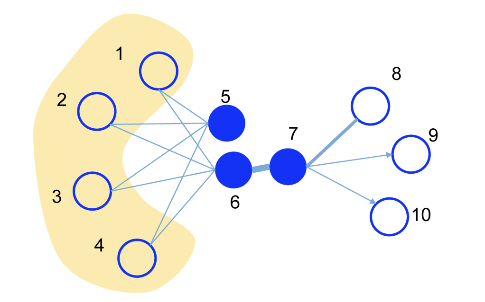
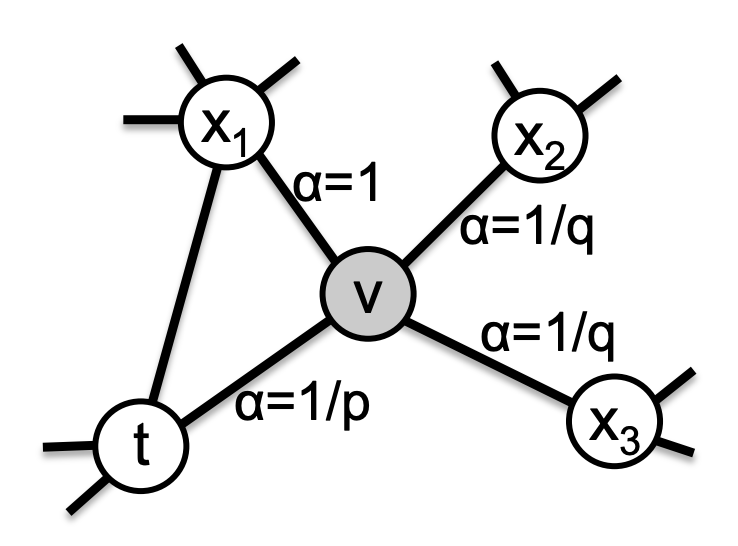

# Graph embedding
Intuitively, we can use one-hot encoding or adjacency matrix to represent every node in a graph. But it has two disadvantages:
1. It results in a very **sparse** graph when there are many nodes.
2. It excludes node features or extra information in the graph.

Therefore, we want to apply graph embedding to obtain a **low-dimensional continuous** representation to keep more information in the graph.

- [DeepWalk](#deepwalk-kdd-14)
- [LINE](#line-www-15)
- [node2vec](#node2vec-kdd-16)

## [DeepWalk (KDD '14)](http://www.perozzi.net/publications/14_kdd_deepwalk.pdf)
​​DeepWalk originates from word2vec, which uses the co-occurrence relationship between nodes to learn the representation. To describe the co-occurrence relationship between nodes, DeepWalk uses **truncated random walk** (random walk with fixed length) to sample nodes in the graph.

**Algorithm 1** $ DeepWalk(G, w, d, \gamma, t) $   
**Input:** graph $G(V,E)$   
$\qquad$ window size $w$   
$\qquad$ embedding size $d$    
$\qquad$ walks per vertex $\gamma$   
$\qquad$ walk length $t$   
**Ouput:** matrix of vertex representations $\Phi \in \mathbb{R}^{|V| \times d}$
1. Initialization: Sample $\Phi$ from $U^{|V| \times d} $   
2. Build a binary Tree $T$ from $V$  $\leftarrow  Hierarchical\ Softmax\ to\ calculate\ Pr(u_k | \Phi(v_j))$ [Tip](## "reduce the computational complexity from O(|V|) to O(log|V|), see Algorithm 2 line 3")
3. **for** $i$ = 0 to $\gamma$ **do**   
4. $\qquad$ $O = Shuffle(V)$   
5. $\qquad$ **for each** $v_i \in O$ **do**   
6. $\qquad\qquad$ $W_{v_i} = RandomWalk(G, v_i, t)$   
7. $\qquad\qquad$ $SkipGram(\Phi, W_{v_i}, w)$   $\leftarrow \underset {\Phi}{minimize}\ -log\ Pr(\{v_{i-w},...,v_{i+w}\} \setminus v_i |\ \Phi(v_i))=\overset{j=i+w}{\underset{\underset{j \not ={i}}{j=i-w}}{\prod}}\ Pr(v_j|\Phi(v_i))$ [Tip](## "It approximates the conditional probability using an independence assumption")
8. $\qquad$ **end for**   
9. **end for** 

**Algorithm 2** $SkipGram(\Phi, W_{v_i}, w)$    
1. **for each** $v_j \in W_{v_i}$ **do**
2. $\qquad$ **for each** $u_k \in W_{v_i}[j-w:j+w]$ **do**
3. $\qquad\qquad$ $J(\Phi)=-log\ Pr(u_k | \Phi(v_j))$
4. $\qquad\qquad$ $\Phi = \Phi - \alpha\ * \frac{\partial J}{\partial \Phi}$
5. $\qquad$ **end for**       
6. **end for** 

### The advantage of using random walk:
1. **Parallelizable**: For a large network, random walks can be performed at different vertices at the same time, reducing the sampling time.
2. **Scalable**: The evolution of the network is usually the change of local points and edges. Such changes will only affect some random walk paths, so it is not necessary to recalculate the random walk of the entire network every time during the evolution of the network.

### Why use word2vec:
The distribution of random walks in the network is similar to the power-law distribution of the sequence of sentences in NLP in the corpus.

### Why use skip-gram:
1. Use missing words(nodes) to predict context because it is too complicated to calculate the context.
1. Consider bilateral nodes within the window size $w$ for the given node.
2. Order independence captures a sense of ‘nearnes.

[Back to top](#graph-embedding)

## [LINE (WWW '15)](https://arxiv.org/pdf/1503.03578.pdf)
LINE (Large-scale Information Network Embedding) is suitable for arbitrary types of information networks: undirected, directed, and/or weighted. The method optimizes an objective function that preserves both the first-order proximity and second-order proximity.

    

**First-order proximity**: the local pairwise proximity between two vertices, i.e, nodes with direct links in the networks (vertex 6 and vertex 7).       
**Second-order proximity**: the similarity between their neighborhood network structures, nodes with shared neighbors being likely to be similar (vertex 5 and vertex 6).

### First-order proximity:
For each undirected edge $(i, j)$, it computes both [joint probability](## "a sigmoid function") $p_1$ and empirical probability $\hat p_1$ and tries to minimize the KL-divergence of two probability distributions $O_1$.

**Joint probability:** $p_1(v_i, v_j) = \frac{1}{1+exp(-\vec{u}_i^T \cdot \vec{u}_j)},\ \vec{u}_i \in R^d,$

**Empirical probability:** $\hat p_1(i, j) = \frac{w_{ij}}{W},\ W=\sum_{(i,j) \in E}w_{ij},$

**Objective function:** $O_1 = d(\hat p_1( \cdot , \cdot ),\ p_1( \cdot , \cdot )),$

$\because D_{KL} (p||q) = \overset{n}{\underset{i=1}{\sum}}\ p(x_i)log(\frac{p(x_i)}{q(x_i)}),$ 

$\therefore O_1 = \sum_{(i,j) \in E} \frac{w_{ij}}{W} log(\frac{w_{ij}}{W}/p_1(v_i, v_j)) = \sum_{(i,j) \in E} \frac{w_{ij}}{W} log\frac{w_{ij}}{W} - \sum_{(i,j) \in E} \frac{w_{ij}}{W}log(p_1(v_i, v_j))$ 

By omitting constants $\sum_{(i,j) \in E} \frac{w_{ij}}{W} log\frac{w_{ij}}{W}$ and $W$, the paper got the final objective function

$O_1 = - \sum_{(i,j) \in E} w_{ij}\ log\ p_1(v_i, v_j)$ 

**[Note]**: The first-order proximity is only applicable for *undirected graphs*, not for directed graphs.

### Second-order proximity:
For each directed edge $(i, j)$, it defines the [probability of “context”](## "a softmax function") $v_j$ generated by vertex $v_i$ as:      

**Context probability:** $p_2(v_j|v_i) = \frac{exp(-\vec{u'}_j^T \cdot \vec{u}_i)}{\overset{|V|}{\underset{k=1}{\sum}}exp(-\vec{u'}_k^T \cdot \vec{u}_i)},$ 

$\vec{u_i}$ is the representation of $v_i$ when it is treated as a [vertex](## "also, the final representation of the second-order proximity"), and $\vec{u'_i}$ is the representation of $v_i$ when it is treated as a specific “context”.

**Empirical probability:** $\hat p_2(v_j|v_i) = \frac{w_{ij}}{d_i}, d_i$ is the out-degree of vertex $i,$

**Objective function:** $O_2 = \underset{i \in V}{\sum}\ \lambda_i d(\hat p_2( \cdot | v_i ),\ p_2( \cdot | v_i )),$

$\lambda_i$ represents [the prestige of vertex](## "measured by the degree or estimated through algorithms such as PageRank ") $i$ in the network, here $\lambda_i = d_i$. After applying KL-divergence, 

$O_2 = \underset{(i,j) \in E}{\sum}\ \lambda_i \frac{w_{ij}}{d_i}log(\frac{w_{ij}}{d_i}/\ p_2( v_j| v_i )) = \underset{(i,j) \in E}{\sum}\ w_{ij}log(\frac{w_{ij}}{d_i}) - \underset{(i,j) \in E}{\sum}w_{ij} p_2( v_j| v_i ) $

By omitting constant $\underset{(i,j) \in E}{\sum}\ w_{ij}log(\frac{w_{ij}}{d_i})$, the paper got the final objective function

$O_2 = - \underset{(i,j) \in E}{\sum}w_{ij} p_2( v_j| v_i ) $

**[Note]**: The second-order proximity is applicable for both *directed and undirected graphs*.

### Combined embedding
The paper trained the LINE model which preserves the first-order proximity and second-order proximity **separately** and then **concatenate the embeddings** trained by the two methods for each vertex

### How to solve gradient explosion of SGD in weighted graph:
The paper presents an *edge-sampling method*, which samples the edges with the probabilities proportional to their weights, and then treat the sampled edges as binary edges for model updating. 

[Back to top](#graph-embedding)

## [node2vec (KDD' 16)](https://arxiv.org/pdf/1607.00653.pdf)
node2vec is a semi-supervised algorithm for scalable feature learning in networks. The objective is to maximize the likelihood of preserving network neighborhoods of nodes in a d-dimensional feature space. It uses **biased 2nd-order random walk** to perform network sampling. The key contribution of this work includes two parts: 
1. Define a **flexible** notion of a node’s network neighborhood
2. Extend node representation to **edge embedding**

**Homophily**: organized based on communities they belong to       
**Structural Equivalence**: organized based on structural roles of nodes in the network

**Depth-first Sampling (DFS)**: The neighborhood consists of nodes  sequentially sampled at increasing distances from the source node. *Tend to Find Homophily*         
1. **Macro-view**: essential in inferring communities based on homophily
2. **High variance** in characterizing the distribution of nodes

**Breadth-first Sampling (BFS)**: The neighborhood is restricted to nodes which are immediate neighbors of the source. *Tend to Find Structural Equivalence*
1. **Micro-view**: it characterize the local neighborhoods accurately
2. **Low variance** in characterizing the distribution of nodes

### What is biased 2nd-order random walk:

    

The $2^{nd}$ order random walk means it considers last traversed nodes $t$, current node $v$, and next node(s) $x$. The "biased" means the random walk is controlled by [return parameter](## "controls the likelihood of immediately revisiting a node in the walk") $p$ and [in-out parameter](## "allows the search to differentiate between “inward” and “outward” nodes")  $q$.

**Sampling distribution**:

$$
P(c_i=x | c_{i-1}=v) = 
\begin{cases}
\frac{\pi_{vx}}{Z} \quad if\ (v,x) \in E \\
0  \qquad otherwise\\
\end{cases}
$$

$c_i$: $i$ th node in the walk,         
$\pi_{vx}$: unnormalized transition probability between nodes between $v$ and $x$, $\pi_{vx} = \alpha_{pq} (t,x) \cdot w_{vx}$
$Z$: normalizing constant            

**Search bias**:

$$ 
\alpha_{pq}(t,x) = 
\begin{cases} 
\frac{1}{p}, &if\ d_{tx} = 0 \leftarrow Go\ back \\
1, &if\ d_{tx} = 1 \leftarrow Stay\ the\ same\ distance \\ 
\frac{1}{q}, &if\ d_{tx} = 2 \leftarrow Go\ further
\end{cases} 
$$

$p > max(q, 1)$: less likely to sample an already visited node in the following two steps,      
$p < max(q, 1)$: lead the walk to backtrack a step and keep the walk “local”
$q > 1$: bias towards nodes close to node $t$ $\rightarrow$ obtain a local view and approximate BFS behavior          
$q < 1$: incline to nodes away from node $t$ $\rightarrow$ obtain an outward exploration and approximate DFS behavior 

### Why it does not use truncated random walk:
Because the completely random sampling fails to offer any flexibility in sampling of nodes from a network

[Back to top](#graph-embedding)